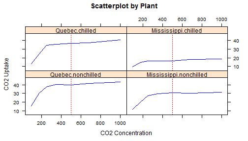

## Executive Summary 

The study was based on data from an experiment on the cold tolerance of the
grass species Echinochloa crusgalli. The CO2 uptake of six plants from Quebec and six plants from Mississippi was measured at several levels of ambient CO2 concentration. Half the plants of each type were chilled overnight before the experiment was conducted.

A model was developed to investigate the relationship of CO2 uptake under various predictors: Plant Type, Treatment and CO2 Concentration. 

Models were built on glm (generalized linear model) for 4 different combination of plant type and treatment. An interactive Shiny app was developed to predict CO2 uptake based on selection of predictors combination. 

As a conslusion, the model shows carbon dioxide uptake rates (umol/m^2 sec) of different plant raises sharply at low concentration level. Co2 uptake rate slows down with ambient carbon dioxide concentrations reach between 200 to 300 mL/L.

--- .class #id 
## Prediction Model Development 

### Data Loading and Cleansing 

The CO2 data frame has 84 rows and 5 columns of data: Plant, Type, Treatment, conc and uptake. CO2 data frame was loaded and a new predictor (TT) was built by combining the plant type and treatment.  

### Model Fitting

Prediction model is built on CO2 dataset and the fitted glm regression model.
Prediction is based on 2 inputs 'TT' and 'CO2 Concentration'. 

### Interacive Prediction Appication 

A Shiny application was built to predicts CO2 uptake by plant type+treatment and CO2 concentration. User can select from one of four combinations of plant type and treatment along with the CO2 Concentration Level. 

The Shiny application can be found on URL: https://lamchankuen.shinyapps.io/DevDataProd/ 

--- .class #id 
## Usage  

To run prediction of CO2 uptake: 
* 1. Select from 1 of the 4 Plant Type and Treatment combination: 
+ 1.1 Quebec Chilled / 1.2 Quebec Non Chilled / 1.3 Mississippi Chilled / 1.4 Mississippi Non Chilled
* 2. Set CO2 concentration level (mL/L):
+ A slider is created for input of CO2 concentration level between 0 to 1000 mL/L with step of 50mL/L. The default is set at 500mL/L. 

Output:
+ 1. Prediction of CO2 Uptake Rate is calculated on the fly.
+ 2. A scatterplot of fitted lines with the prediction level (in red). 
+ 3. The prediction of CO2 uptake can also be found at intercept of the prediction level (red) and the fitted line (blue). 

--- .class #id 
## Example and Conclusion 

Below is a scatterplot of models based on the default CO2 Concentration value of 500 for Quebec.chilled. The predicted value is 33.2961444. 

 
### Conclusion 
The Scatterplot  shows there is significant difference of CO2 uptake under between plant type and treatment. The Shiny application provides a great interactive way for users to predict CO2 Uptake rate based on the two predictors defined. 

